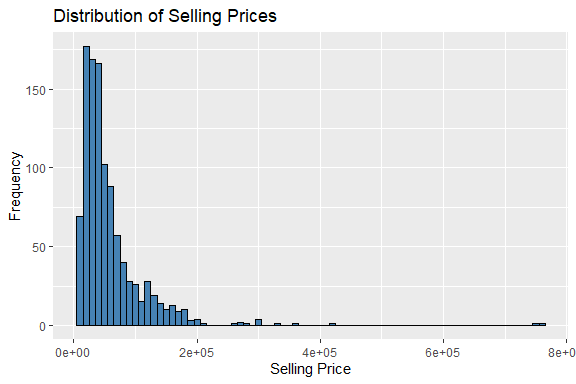
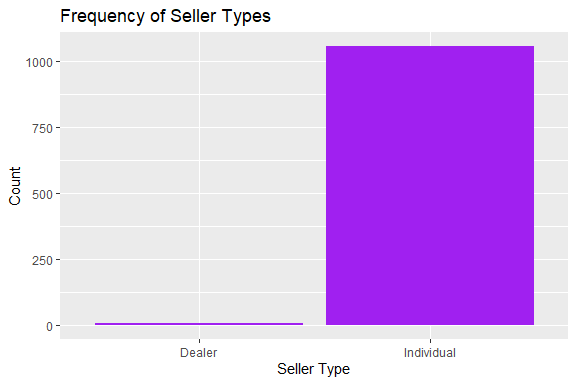
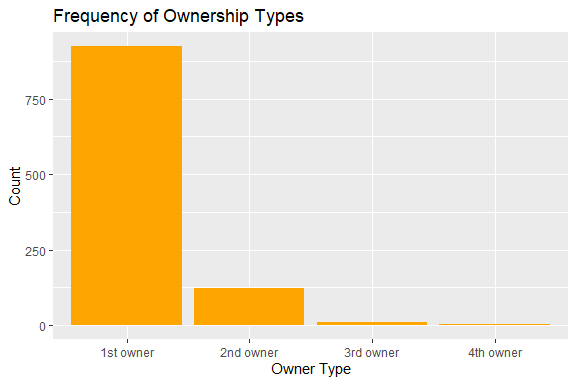
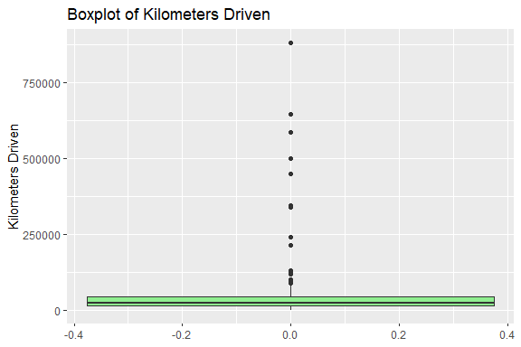
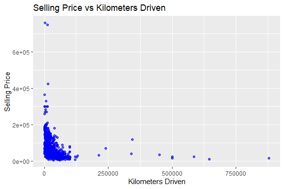
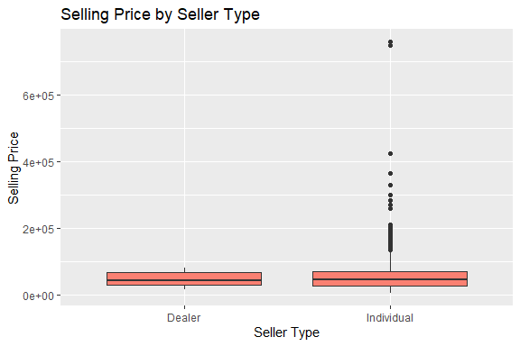
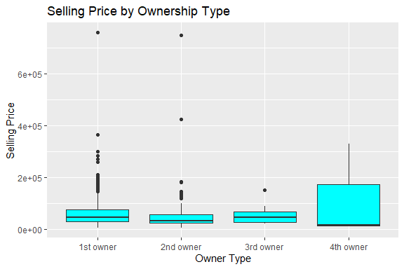
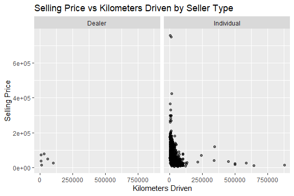
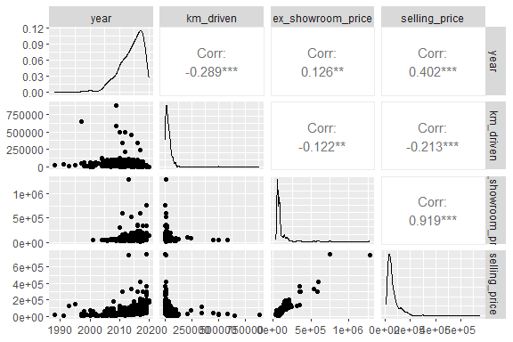

Motorcycle Price Prediction
================
Trevor Okinda
2024

- [Student Details](#student-details)
- [Setup Chunk](#setup-chunk)
  - [Source:](#source)
  - [Reference:](#reference)
- [Understanding the Dataset (Exploratory Data Analysis
  (EDA))](#understanding-the-dataset-exploratory-data-analysis-eda)
  - [Loading the Dataset](#loading-the-dataset)
  - [Measures of Frequency](#measures-of-frequency)
  - [Measures of Central Tendency](#measures-of-central-tendency)
  - [Measures of Distribution](#measures-of-distribution)
  - [Measures of Relationship](#measures-of-relationship)
  - [ANOVA](#anova)
  - [Plots](#plots)
- [Preprocessing and Data
  Transformation](#preprocessing-and-data-transformation)
  - [Missing Values](#missing-values)
  - [Imputation](#imputation)
- [Model Training](#model-training)
  - [Data Splitting](#data-splitting)
  - [Bootstrapping](#bootstrapping)
  - [Cross-validation](#cross-validation)
  - [Training Different Models](#training-different-models)
  - [Performance Comparison](#performance-comparison)
  - [Saving Model](#saving-model)

# Student Details

|                       |                             |
|-----------------------|-----------------------------|
| **Student ID Number** | 134780                      |
| **Student Name**      | Trevor Okinda               |
| **BBIT 4.2 Group**    | C                           |
| **Project Name**      | Motorcycle Price Prediction |

# Setup Chunk

**Note:** the following KnitR options have been set as the global
defaults: <BR>
`knitr::opts_chunk$set(echo = TRUE, warning = FALSE, eval = TRUE, collapse = FALSE, tidy = TRUE)`.

More KnitR options are documented here
<https://bookdown.org/yihui/rmarkdown-cookbook/chunk-options.html> and
here <https://yihui.org/knitr/options/>.

### Source:

The dataset that was used can be downloaded here:
*\<<a href="https://www.kaggle.com/datasets/nehalbirla/motorcycle-dataset\"
class="uri">https://www.kaggle.com/datasets/nehalbirla/motorcycle-dataset\</a>\>*

### Reference:

*\<Birla, N. (n.d.). Motorcycle Dataset \[Data set\]. Kaggle.
<a href="https://www.kaggle.com/datasets/nehalbirla/motorcycle-dataset\"
class="uri">https://www.kaggle.com/datasets/nehalbirla/motorcycle-dataset\</a>\>  
Refer to the APA 7th edition manual for rules on how to cite datasets:
<https://apastyle.apa.org/style-grammar-guidelines/references/examples/data-set-references>*

# Understanding the Dataset (Exploratory Data Analysis (EDA))

## Loading the Dataset

``` r
# Load dataset with specified column classes
vehicle_data <- read.csv("BIKE_DETAILS.csv", colClasses = c(
  name = "character",
  year = "integer",
  seller_type = "factor",
  owner = "factor",
  km_driven = "integer",
  ex_showroom_price = "numeric",
  selling_price = "numeric"
))

# Verify the structure to ensure column types are correct
str(vehicle_data)
```

    ## 'data.frame':    1061 obs. of  8 variables:
    ##  $ name             : chr  "Royal Enfield Classic 350" "Honda Dio" "Royal Enfield Classic Gunmetal Grey" "Yamaha Fazer FI V 2.0 [2016-2018]" ...
    ##  $ X                : logi  NA NA NA NA NA NA ...
    ##  $ year             : int  2019 2017 2018 2015 2011 2010 2018 2008 2010 2016 ...
    ##  $ seller_type      : Factor w/ 2 levels "Dealer","Individual": 2 2 2 2 2 2 2 2 2 2 ...
    ##  $ owner            : Factor w/ 4 levels "1st owner","2nd owner",..: 1 1 1 1 2 1 1 2 1 1 ...
    ##  $ km_driven        : int  350 5650 12000 23000 21000 60000 17000 39000 32000 42000 ...
    ##  $ ex_showroom_price: num  NA NA 148114 89643 NA ...
    ##  $ selling_price    : num  175000 45000 150000 65000 20000 18000 78500 180000 30000 50000 ...

``` r
# Display the first few rows to confirm data loading
head(vehicle_data)
```

    ##                                  name  X year seller_type     owner km_driven
    ## 1           Royal Enfield Classic 350 NA 2019  Individual 1st owner       350
    ## 2                           Honda Dio NA 2017  Individual 1st owner      5650
    ## 3 Royal Enfield Classic Gunmetal Grey NA 2018  Individual 1st owner     12000
    ## 4   Yamaha Fazer FI V 2.0 [2016-2018] NA 2015  Individual 1st owner     23000
    ## 5               Yamaha SZ [2013-2014] NA 2011  Individual 2nd owner     21000
    ## 6                    Honda CB Twister NA 2010  Individual 1st owner     60000
    ##   ex_showroom_price selling_price
    ## 1                NA        175000
    ## 2                NA         45000
    ## 3            148114        150000
    ## 4             89643         65000
    ## 5                NA         20000
    ## 6             53857         18000

``` r
View(vehicle_data)
```

## Measures of Frequency

``` r
# Load necessary library for summary statistics
library(dplyr)
```

    ## 
    ## Attaching package: 'dplyr'

    ## The following objects are masked from 'package:stats':
    ## 
    ##     filter, lag

    ## The following objects are masked from 'package:base':
    ## 
    ##     intersect, setdiff, setequal, union

``` r
# Frequency of seller type
seller_type_freq <- table(vehicle_data$seller_type)
print(seller_type_freq)
```

    ## 
    ##     Dealer Individual 
    ##          6       1055

``` r
# Frequency of owner type
owner_freq <- table(vehicle_data$owner)
print(owner_freq)
```

    ## 
    ## 1st owner 2nd owner 3rd owner 4th owner 
    ##       924       123        11         3

## Measures of Central Tendency

``` r
# Mean, median, and mode for numerical columns

# Mean
mean_year <- mean(vehicle_data$year, na.rm = TRUE)
mean_km_driven <- mean(vehicle_data$km_driven, na.rm = TRUE)
mean_ex_showroom_price <- mean(vehicle_data$ex_showroom_price, na.rm = TRUE)
mean_selling_price <- mean(vehicle_data$selling_price, na.rm = TRUE)

# Median
median_year <- median(vehicle_data$year, na.rm = TRUE)
median_km_driven <- median(vehicle_data$km_driven, na.rm = TRUE)
median_ex_showroom_price <- median(vehicle_data$ex_showroom_price, na.rm = TRUE)
median_selling_price <- median(vehicle_data$selling_price, na.rm = TRUE)

# Mode function
get_mode <- function(v) {
  uniq_v <- unique(v)
  uniq_v[which.max(tabulate(match(v, uniq_v)))]
}

mode_owner <- get_mode(vehicle_data$owner)
mode_seller_type <- get_mode(vehicle_data$seller_type)

print(list(
  mean_year = mean_year, mean_km_driven = mean_km_driven,
  mean_ex_showroom_price = mean_ex_showroom_price, mean_selling_price = mean_selling_price,
  median_year = median_year, median_km_driven = median_km_driven,
  median_ex_showroom_price = median_ex_showroom_price, median_selling_price = median_selling_price,
  mode_owner = mode_owner, mode_seller_type = mode_seller_type
))
```

    ## $mean_year
    ## [1] 2013.867
    ## 
    ## $mean_km_driven
    ## [1] 34359.83
    ## 
    ## $mean_ex_showroom_price
    ## [1] 87958.71
    ## 
    ## $mean_selling_price
    ## [1] 59638.15
    ## 
    ## $median_year
    ## [1] 2015
    ## 
    ## $median_km_driven
    ## [1] 25000
    ## 
    ## $median_ex_showroom_price
    ## [1] 72752.5
    ## 
    ## $median_selling_price
    ## [1] 45000
    ## 
    ## $mode_owner
    ## [1] 1st owner
    ## Levels: 1st owner 2nd owner 3rd owner 4th owner
    ## 
    ## $mode_seller_type
    ## [1] Individual
    ## Levels: Dealer Individual

## Measures of Distribution

``` r
# Variance and standard deviation
variance_km_driven <- var(vehicle_data$km_driven, na.rm = TRUE)
sd_km_driven <- sd(vehicle_data$km_driven, na.rm = TRUE)

variance_ex_showroom_price <- var(vehicle_data$ex_showroom_price, na.rm = TRUE)
sd_ex_showroom_price <- sd(vehicle_data$ex_showroom_price, na.rm = TRUE)

variance_selling_price <- var(vehicle_data$selling_price, na.rm = TRUE)
sd_selling_price <- sd(vehicle_data$selling_price, na.rm = TRUE)

# Range
range_year <- range(vehicle_data$year, na.rm = TRUE)
range_km_driven <- range(vehicle_data$km_driven, na.rm = TRUE)
range_ex_showroom_price <- range(vehicle_data$ex_showroom_price, na.rm = TRUE)
range_selling_price <- range(vehicle_data$selling_price, na.rm = TRUE)

# Range
range_year <- range(vehicle_data$year, na.rm = TRUE)
range_km_driven <- range(vehicle_data$km_driven, na.rm = TRUE)
range_ex_showroom_price <- range(vehicle_data$ex_showroom_price, na.rm = TRUE)
range_selling_price <- range(vehicle_data$selling_price, na.rm = TRUE)

# Quantiles
quantiles_km_driven <- quantile(vehicle_data$km_driven, na.rm = TRUE)
quantiles_ex_showroom_price <- quantile(vehicle_data$ex_showroom_price, na.rm = TRUE)
quantiles_selling_price <- quantile(vehicle_data$selling_price, na.rm = TRUE)

# Interquartile range (IQR)
iqr_km_driven <- IQR(vehicle_data$km_driven, na.rm = TRUE)
iqr_ex_showroom_price <- IQR(vehicle_data$ex_showroom_price, na.rm = TRUE)
iqr_selling_price <- IQR(vehicle_data$selling_price, na.rm = TRUE)

print(list(
  variance_km_driven = variance_km_driven, sd_km_driven = sd_km_driven,
  variance_ex_showroom_price = variance_ex_showroom_price, sd_ex_showroom_price = sd_ex_showroom_price,
  variance_selling_price = variance_selling_price, sd_selling_price = sd_selling_price,
  range_year = range_year, range_km_driven = range_km_driven,
  range_ex_showroom_price = range_ex_showroom_price, range_selling_price = range_selling_price,
  quantiles_km_driven = quantiles_km_driven, quantiles_ex_showroom_price = quantiles_ex_showroom_price,
  quantiles_selling_price = quantiles_selling_price,
  iqr_km_driven = iqr_km_driven, iqr_ex_showroom_price = iqr_ex_showroom_price,
  iqr_selling_price = iqr_selling_price
))
```

    ## $variance_km_driven
    ## [1] 2664949895
    ## 
    ## $sd_km_driven
    ## [1] 51623.15
    ## 
    ## $variance_ex_showroom_price
    ## [1] 6005721026
    ## 
    ## $sd_ex_showroom_price
    ## [1] 77496.59
    ## 
    ## $variance_selling_price
    ## [1] 3170173295
    ## 
    ## $sd_selling_price
    ## [1] 56304.29
    ## 
    ## $range_year
    ## [1] 1988 2020
    ## 
    ## $range_km_driven
    ## [1]    350 880000
    ## 
    ## $range_ex_showroom_price
    ## [1]   30490 1278000
    ## 
    ## $range_selling_price
    ## [1]   5000 760000
    ## 
    ## $quantiles_km_driven
    ##     0%    25%    50%    75%   100% 
    ##    350  13500  25000  43000 880000 
    ## 
    ## $quantiles_ex_showroom_price
    ##        0%       25%       50%       75%      100% 
    ##   30490.0   54852.0   72752.5   87031.5 1278000.0 
    ## 
    ## $quantiles_selling_price
    ##     0%    25%    50%    75%   100% 
    ##   5000  28000  45000  70000 760000 
    ## 
    ## $iqr_km_driven
    ## [1] 29500
    ## 
    ## $iqr_ex_showroom_price
    ## [1] 32179.5
    ## 
    ## $iqr_selling_price
    ## [1] 42000

## Measures of Relationship

``` r
# Correlation matrix for numerical variables
cor_matrix <- cor(vehicle_data %>% select(year, km_driven, ex_showroom_price, selling_price), use = "complete.obs")
print(cor_matrix)
```

    ##                         year  km_driven ex_showroom_price selling_price
    ## year               1.0000000 -0.3298232         0.1263783     0.3506536
    ## km_driven         -0.3298232  1.0000000        -0.1220106    -0.1940930
    ## ex_showroom_price  0.1263783 -0.1220106         1.0000000     0.9185833
    ## selling_price      0.3506536 -0.1940930         0.9185833     1.0000000

``` r
# Covariance matrix
cov_matrix <- cov(vehicle_data %>% select(year, km_driven, ex_showroom_price, selling_price), use = "complete.obs")
print(cov_matrix)
```

    ##                            year     km_driven ex_showroom_price selling_price
    ## year                   9.113664     -45284.02          29566.62      63413.71
    ## km_driven         -45284.020665 2068399568.26     -430028600.55 -528792717.26
    ## ex_showroom_price  29566.621212 -430028600.55     6005721026.01 4264415337.00
    ## selling_price      63413.706507 -528792717.26     4264415337.00 3588531255.33

## ANOVA

``` r
## ANOVA test for selling price across different seller types
anova_seller_type <- aov(selling_price ~ seller_type, data = vehicle_data)
summary(anova_seller_type)
```

    ##               Df    Sum Sq   Mean Sq F value Pr(>F)
    ## seller_type    1 1.015e+09 1.015e+09    0.32  0.572
    ## Residuals   1059 3.359e+12 3.172e+09

``` r
# ANOVA test for selling price across different ownership categories
anova_owner <- aov(selling_price ~ owner, data = vehicle_data)
summary(anova_owner)
```

    ##               Df    Sum Sq   Mean Sq F value Pr(>F)
    ## owner          3 1.258e+10 4.193e+09   1.324  0.265
    ## Residuals   1057 3.348e+12 3.167e+09

``` r
# Perform Tukey's HSD post-hoc test if ANOVA is significant
tukey_seller_type <- TukeyHSD(anova_seller_type)
print(tukey_seller_type)
```

    ##   Tukey multiple comparisons of means
    ##     95% family-wise confidence level
    ## 
    ## Fit: aov(formula = selling_price ~ seller_type, data = vehicle_data)
    ## 
    ## $seller_type
    ##                       diff       lwr      upr     p adj
    ## Individual-Dealer 13045.26 -32200.87 58291.38 0.5716912

``` r
tukey_owner <- TukeyHSD(anova_owner)
print(tukey_owner)
```

    ##   Tukey multiple comparisons of means
    ##     95% family-wise confidence level
    ## 
    ## Fit: aov(formula = selling_price ~ owner, data = vehicle_data)
    ## 
    ## $owner
    ##                            diff       lwr       upr     p adj
    ## 2nd owner-1st owner -4356.15532 -18255.29   9542.98 0.8514266
    ## 3rd owner-1st owner -4295.54113 -48216.97  39625.89 0.9944063
    ## 4th owner-1st owner 58310.51948 -25432.04 142053.08 0.2778574
    ## 3rd owner-2nd owner    60.61419 -45512.27  45633.49 1.0000000
    ## 4th owner-2nd owner 62666.67480 -21953.72 147287.07 0.2262541
    ## 4th owner-3rd owner 62606.06061 -31715.29 156927.41 0.3199854

## Plots

``` r
library(ggplot2)

# Histogram of selling prices
ggplot(vehicle_data, aes(x = selling_price)) +
  geom_histogram(binwidth = 10000, fill = "steelblue", color = "black") +
  labs(title = "Distribution of Selling Prices", x = "Selling Price", y = "Frequency")
```

<!-- -->

``` r
# Bar plot for seller type
ggplot(vehicle_data, aes(x = seller_type)) +
  geom_bar(fill = "purple") +
  labs(title = "Frequency of Seller Types", x = "Seller Type", y = "Count")
```

<!-- -->

``` r
# Bar plot for owner type
ggplot(vehicle_data, aes(x = owner)) +
  geom_bar(fill = "orange") +
  labs(title = "Frequency of Ownership Types", x = "Owner Type", y = "Count")
```

<!-- -->

``` r
# Boxplot for kilometers driven
ggplot(vehicle_data, aes(y = km_driven)) +
  geom_boxplot(fill = "lightgreen") +
  labs(title = "Boxplot of Kilometers Driven", y = "Kilometers Driven")
```

<!-- -->

``` r
# Scatter plot of kilometers driven vs selling price
ggplot(vehicle_data, aes(x = km_driven, y = selling_price)) +
  geom_point(color = "blue", alpha = 0.6) +
  labs(title = "Selling Price vs Kilometers Driven", x = "Kilometers Driven", y = "Selling Price")
```

<!-- -->

``` r
# Boxplot of selling price by seller type
ggplot(vehicle_data, aes(x = seller_type, y = selling_price)) +
  geom_boxplot(fill = "salmon") +
  labs(title = "Selling Price by Seller Type", x = "Seller Type", y = "Selling Price")
```

<!-- -->

``` r
# Boxplot of selling price by owner
ggplot(vehicle_data, aes(x = owner, y = selling_price)) +
  geom_boxplot(fill = "cyan") +
  labs(title = "Selling Price by Ownership Type", x = "Owner Type", y = "Selling Price")
```

<!-- -->

``` r
# Faceted scatter plot of km driven vs selling price by seller type
ggplot(vehicle_data, aes(x = km_driven, y = selling_price)) +
  geom_point(alpha = 0.5) +
  facet_wrap(~ seller_type) +
  labs(title = "Selling Price vs Kilometers Driven by Seller Type", x = "Kilometers Driven", y = "Selling Price")
```

<!-- -->

``` r
library(GGally)
```

    ## Registered S3 method overwritten by 'GGally':
    ##   method from   
    ##   +.gg   ggplot2

``` r
# Pairwise plot for selected variables
ggpairs(vehicle_data, columns = c("year", "km_driven", "ex_showroom_price", "selling_price"))
```

<!-- -->

# Preprocessing and Data Transformation

## Missing Values

``` r
# Check for missing values in each column
missing_values <- sapply(vehicle_data, function(x) sum(is.na(x)))
print(missing_values)
```

    ##              name                 X              year       seller_type 
    ##                 0              1061                 0                 0 
    ##             owner         km_driven ex_showroom_price     selling_price 
    ##                 0                 0               435                 0

``` r
# Summary of total missing values in the dataset
total_missing <- sum(missing_values)
cat("Total missing values in the dataset:", total_missing, "\n")
```

    ## Total missing values in the dataset: 1496

``` r
# Display columns with missing values, if any
if (total_missing > 0) {
  cat("Columns with missing values:\n")
  print(missing_values[missing_values > 0])
} else {
  cat("No missing values found in the dataset.\n")
}
```

    ## Columns with missing values:
    ##                 X ex_showroom_price 
    ##              1061               435

## Imputation

``` r
# Impute missing values in ex_showroom_price with the mean
vehicle_data$ex_showroom_price[is.na(vehicle_data$ex_showroom_price)] <- mean(vehicle_data$ex_showroom_price, na.rm = TRUE)

View(vehicle_data)

# Remove the 'X' column from the dataset
vehicle_data <- vehicle_data[, !(names(vehicle_data) %in% "X")]

# Verify the column has been removed
print(names(vehicle_data))
```

    ## [1] "name"              "year"              "seller_type"      
    ## [4] "owner"             "km_driven"         "ex_showroom_price"
    ## [7] "selling_price"

``` r
View(vehicle_data)
```

# Model Training

## Data Splitting

``` r
library(caret)
```

    ## Loading required package: lattice

``` r
# Set seed for reproducibility
set.seed(123)

# Split the data into training (70%) and testing (30%) sets
train_index <- createDataPartition(vehicle_data$selling_price, p = 0.7, list = FALSE)
train_data <- vehicle_data[train_index, ]
test_data <- vehicle_data[-train_index, ]

# Check dimensions of the splits
cat("Training set dimensions:", dim(train_data), "\n")
```

    ## Training set dimensions: 744 7

``` r
cat("Testing set dimensions:", dim(test_data), "\n")
```

    ## Testing set dimensions: 317 7

## Bootstrapping

``` r
# Bootstrapping with 100 samples
boot_samples <- 100
boot_results <- list()

for (i in 1:boot_samples) {
  # Resample the training data with replacement
  boot_sample <- train_data[sample(1:nrow(train_data), replace = TRUE), ]
  
  # Fit a model to the bootstrap sample (e.g., linear regression)
  boot_model <- lm(selling_price ~ km_driven + ex_showroom_price, data = boot_sample)
  
  # Store the model results
  boot_results[[i]] <- summary(boot_model)$coefficients
}

# Display results from a sample bootstrapped model
print(boot_results[[1]])
```

    ##                       Estimate   Std. Error   t value      Pr(>|t|)
    ## (Intercept)       3234.8944284 2.348591e+03  1.377376  1.688118e-01
    ## km_driven           -0.1324540 2.203669e-02 -6.010611  2.898820e-09
    ## ex_showroom_price    0.6993122 1.917382e-02 36.472236 1.473078e-167

## Cross-validation

``` r
# K-Fold Cross-Validation with 5 folds
train_control <- trainControl(method = "cv", number = 5)
model_cv <- train(selling_price ~ km_driven + ex_showroom_price,
                  data = train_data,
                  method = "lm",
                  trControl = train_control)

# Summary of cross-validation results
print(model_cv)
```

    ## Linear Regression 
    ## 
    ## 744 samples
    ##   2 predictor
    ## 
    ## No pre-processing
    ## Resampling: Cross-Validated (5 fold) 
    ## Summary of sample sizes: 594, 596, 594, 597, 595 
    ## Resampling results:
    ## 
    ##   RMSE      Rsquared   MAE     
    ##   36452.64  0.5261634  25024.31
    ## 
    ## Tuning parameter 'intercept' was held constant at a value of TRUE

## Training Different Models

``` r
library(caret)
library(rpart)
library(randomForest)
```

    ## randomForest 4.7-1.1

    ## Type rfNews() to see new features/changes/bug fixes.

    ## 
    ## Attaching package: 'randomForest'

    ## The following object is masked from 'package:ggplot2':
    ## 
    ##     margin

    ## The following object is masked from 'package:dplyr':
    ## 
    ##     combine

``` r
# Train a Linear Regression model
set.seed(123)
linear_model <- train(selling_price ~ km_driven + ex_showroom_price,
                      data = train_data,
                      method = "lm")

# Display summary of the Linear Regression model
summary(linear_model$finalModel)
```

    ## 
    ## Call:
    ## lm(formula = .outcome ~ ., data = dat)
    ## 
    ## Residuals:
    ##     Min      1Q  Median      3Q     Max 
    ## -154080  -22899   -5060   11939  226307 
    ## 
    ## Coefficients:
    ##                     Estimate Std. Error t value Pr(>|t|)    
    ## (Intercept)       2752.05681 2441.97797   1.127     0.26    
    ## km_driven           -0.13333    0.02274  -5.864 6.81e-09 ***
    ## ex_showroom_price    0.70652    0.02044  34.559  < 2e-16 ***
    ## ---
    ## Signif. codes:  0 '***' 0.001 '**' 0.01 '*' 0.05 '.' 0.1 ' ' 1
    ## 
    ## Residual standard error: 36640 on 741 degrees of freedom
    ## Multiple R-squared:  0.6312, Adjusted R-squared:  0.6302 
    ## F-statistic:   634 on 2 and 741 DF,  p-value: < 2.2e-16

``` r
# Train a Decision Tree model
set.seed(123)
decision_tree_model <- train(selling_price ~ km_driven + ex_showroom_price,
                             data = train_data,
                             method = "rpart")

# Display the Decision Tree model
print(decision_tree_model$finalModel)
```

    ## n= 744 
    ## 
    ## node), split, n, deviance, yval
    ##       * denotes terminal node
    ## 
    ## 1) root 744 2.697058e+12  60465.42  
    ##   2) ex_showroom_price< 347000 737 1.308533e+12  56657.08  
    ##     4) ex_showroom_price< 132596.5 690 9.563138e+11  51239.52 *
    ##     5) ex_showroom_price>=132596.5 47 3.465928e+10 136191.50 *
    ##   3) ex_showroom_price>=347000 7 2.524357e+11 461428.60 *

``` r
# Plot the decision tree
plot(decision_tree_model$finalModel)
text(decision_tree_model$finalModel, use.n = TRUE)
```

<!-- -->

``` r
# Train a Random Forest model
set.seed(123)
random_forest_model <- train(selling_price ~ km_driven + ex_showroom_price,
                             data = train_data,
                             method = "rf",
                             tuneLength = 5)
```

    ## note: only 1 unique complexity parameters in default grid. Truncating the grid to 1 .

``` r
# Display the Random Forest model
print(random_forest_model)
```

    ## Random Forest 
    ## 
    ## 744 samples
    ##   2 predictor
    ## 
    ## No pre-processing
    ## Resampling: Bootstrapped (25 reps) 
    ## Summary of sample sizes: 744, 744, 744, 744, 744, 744, ... 
    ## Resampling results:
    ## 
    ##   RMSE      Rsquared   MAE     
    ##   40326.22  0.5879036  23625.21
    ## 
    ## Tuning parameter 'mtry' was held constant at a value of 2

## Performance Comparison

``` r
# Make predictions on test data
linear_preds <- predict(linear_model, test_data)
decision_tree_preds <- predict(decision_tree_model, test_data)
random_forest_preds <- predict(random_forest_model, test_data)

# Calculate RMSE for each model
linear_rmse <- RMSE(linear_preds, test_data$selling_price)
decision_tree_rmse <- RMSE(decision_tree_preds, test_data$selling_price)
random_forest_rmse <- RMSE(random_forest_preds, test_data$selling_price)

# Print RMSE results
cat("Linear Regression RMSE:", linear_rmse, "\n")
```

    ## Linear Regression RMSE: 35503.95

``` r
cat("Decision Tree RMSE:", decision_tree_rmse, "\n")
```

    ## Decision Tree RMSE: 38558.45

``` r
cat("Random Forest RMSE:", random_forest_rmse, "\n")
```

    ## Random Forest RMSE: 33545.69

## Saving Model

``` r
# Load the saved model
loaded_rf_model <- readRDS("./models/saved_random_forest_model.rds")

# New data for prediction (adjust the values based on your input)
new_data <- data.frame(
  km_driven = 15000,
  ex_showroom_price = 100000
)

# Use the loaded model to make predictions
predictions_loaded_model <- predict(loaded_rf_model, newdata = new_data)

# Print predictions
print(predictions_loaded_model)
```

    ##        1 
    ## 70603.71
